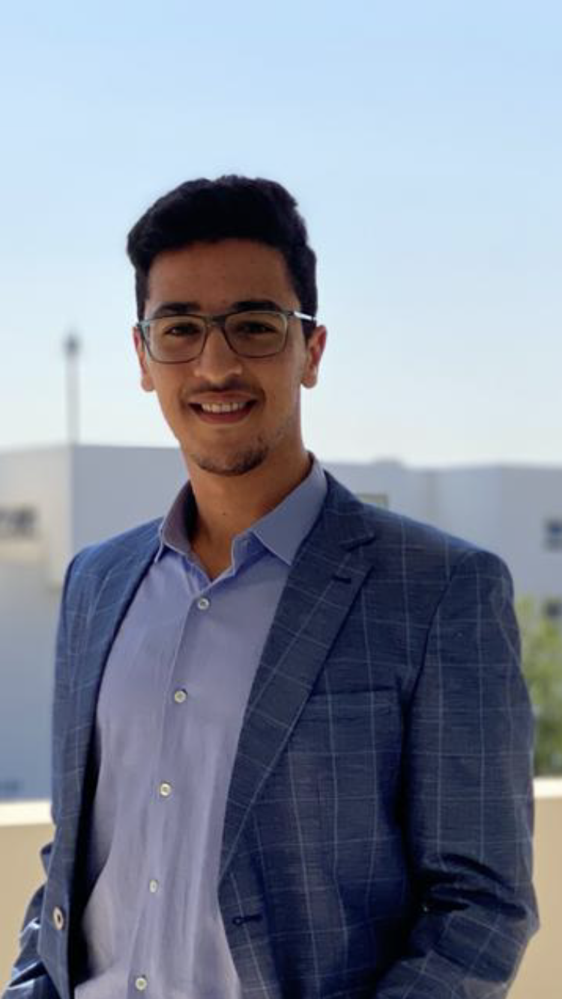

---
hide:
  - navigation
  - toc
title: About
---

<link rel="stylesheet" href="../../stylesheets/home/about.css">

  

    

     

     

      <h1>Ilyass El Fourati</h1>
      <h2>Nanterre (92000), France</h2>
      <h3>ML/AI Engineer | Centralien Engineer<h3>
      

       <a href="https://www.linkedin.com/in/ilyasselfourati" class="ln" style=" color: inherit;" title="LinkedIn - Ilyass El Fourati"><i class="fab fa-linkedin"></i></a>
       <a href="https://github.com/ilyasselfourati" class="git" style=" color: inherit;" title="Github - Ilyass El Fourati"><i class="fab fa-github"></i></a>
       <a href="mailto:<ilyasselfourati@gmail.com>" class="email" style=" color: inherit;" title="Email - ilyasselfourati@gmail.com"><i class="fas fa-paper-plane"></i></a>
      

     

    

  

  

    

     <a href="https://drive.google.com/file/d/13krKmGtHNq4Fo_SaLbYaMnN0Wvmz4VBq/view?usp=drive_link"><strong>Export Resume </strong><i class="far fa-file-alt"></i>
     </a><h1>About</h1>
      

      
<strong>Hello! I’m Ilyass El Fourati,</strong>  a Data Scientist and AI/ML Engineer, holding a degree from digitallab Centrale Marseille and currently pursuing studies at Ecole Centrale Casablanca while interning in my final year. With a deep-rooted belief in the transformative power of technology, I am driven by the prospect of leveraging data to instigate positive change. My passion lies in deploying data science methodologies to untangle intricate challenges and enact tangible enhancements in people's lives. I staunchly advocate for the ethos of hard work and unwavering dedication as fundamental cornerstones of achievement. Echoing the sentiments of celebrated author Stephen King, <strong>'Talent is cheaper than table salt. What separates the talented individual from the successful one is a lot of hard work.'</strong> Committed to perpetual learning and evolution, I am steadfast in my commitment to utilizing my expertise to effect significant advancements in the realm of data science.
     <h2><i class="fas fa-briefcase"></i> Experience -</h2>
     
<strong>Data Scientist Apr 2024 - Oct 2024 <a>Santarelli Group</a></strong> - Internship

      
<strong>𝐂𝐨𝐦𝐩𝐮𝐭𝐞𝐫 𝐕𝐢𝐬𝐢𝐨𝐧 𝐌𝐢𝐬𝐬𝐢𝐨𝐧𝐬:</strong>

     
<strong>Data Leader Mar 2023 - Sept 2023 <a>Forvia</a></strong> - Internship

     

      <ul>
        <li>Collect, analyze, and visualize data from internal software (ETL).
        <li>Implement data storage in a PostgreSQL database.
        <li>Design dynamic dashboards on Foundry (Palantir) to compare data from various sources.
        <li>Optimize an internal search engine by integrating semantics.
        <li>Implement summary models to shorten the length of texts in documents. (NLP)
        </li>
      </ul>
      <b>Librairies & Techniques :</b>
      🛠️Python : Plotly, NLP, Pandas, Transformers, Gensim, HuggingFace, bm25_rank, nltk, ReGex.
      🛠️Foundry (Palantir) 
      🛠️PostgreSQL
      

      
<strong>Data Scientist | Computer Vision Dec 2022 - Mar 2023 <a>NGE</a></strong> - Freelance

      
Reduction of CO2 emissions due to the use of concrete from purchase invoices :
      <ul>
        <li>Collection and cleaning of invoices.
        <li>Extraction of precise data from scanned images using YOLOv7 and DocTR (OCR)
        <li>Detection and counting of people, enabling accurate footfall analysis and facilitating crowd control measures.
        <li>Development of a web application in Python with DASH, allowing for the upload of invoices and the automated generation of an Excel dataframe containing the extracted data.
        </li>
      </ul>
      <b>Libraries & techniques :</b> 
      🛠️Python : Numpy, Dash, Pandas, Sickit-learn, YOLOv7, Tensorflow, OCR, NER, NLP, Streamlit
      

      
<strong>DataFiab ProjectOct 2022 - Dec 2022 <a>Groupe ADF</strong></a> - Freelance

      
The aim of this project is to clean and standardize maintenance data collected from various sources, structure and store it in a database, apply machine learning (NLP) to the textual information, and visualize and highlight the stored data in Power BI.
      <ul>
        <li>Creation of a generalized pipeline to clean, standardize, and store CMMS (SAP) data from various companies using Pandas (Python) and MySQL.
        <li>Extraction of keywords from textual data using TF-IDF, RAKE, and TextRank.
        <li> Detection of themes using Topic Modeling algorithms (BERTopic, LDA, and NMF).
        <li>Comparison of models used for keyword and theme extraction using specific Natural Language Processing (NLP) metrics such as coherence and ROUGE.
        <li>Enhancing data accessibility and readability by creating visualizations such as Pareto charts, NLP algorithm results, failure reports, etc., in Power BI.
        </li>
      </ul>
      <b>Libraries & techniques :</b> 
      🛠️ Python : Numpy, NLP, Pandas, Sickit-learn, Gensim.
      🛠️Power BI : Power Query, DashBoards/Rapports, DAX.
      🛠️MySQL
      

      
<strong>Data Science Project Sept 2022 - Oct 2022 <a>6 PERFORM</strong></a> - Academic Project

      
In-depth study of the impact of COVID on the global economy : 

      <ul>
        <li>
        <li>Data collection, cleaning, analysis and visualisation.
        <li>Creation of a Dashboard (Dash/Plotly) to present the results.
        </li>
      </ul>Scientific Research ProjectOct 2021 - Jan 2022 <a>Ecole Centrale Casablanca</strong></a> - Academic Project

      <ul>
        <li>Collection of data from different satellites
        <li>Evaluation of remote sensing data for predicting extreme rainfall over Morocco.
        </li>
      </ul>
     <h2><i class="fas fa-graduation-cap"></i> Education -</h2>
      
<strong>Data ScienceSept 2022 - Sept 2023 <a>DigitalLab, Ecole Centrale Marseille</a></strong> France, Nice

      
 
      <strong> International exchangeFeb 2022 - Jul 2022 <a>Ecole Centrale Lille</a></strong> France, Lille
      

      
 
      <strong>Data Science and digitalizationSept 2020 - Oct 2024 <a href="http://www.centrale-casablanca.ma/fr/">Ecole Centrale Casablanca</a></strong> Morocco, Casablanca
      

      
<strong>Mathematics & Physics Engineering ScienceSept 2018 - Apr 2020 <a href="https://fabacademy.org/">Preparatory Classes Ibn Timiya</a></strong> Morocco, Marrakech

      

        
          

          
        
      

     <h2><i class="fas fa-headphones-alt"></i> What I'm Listening To -</h2>
      

       
    

  

